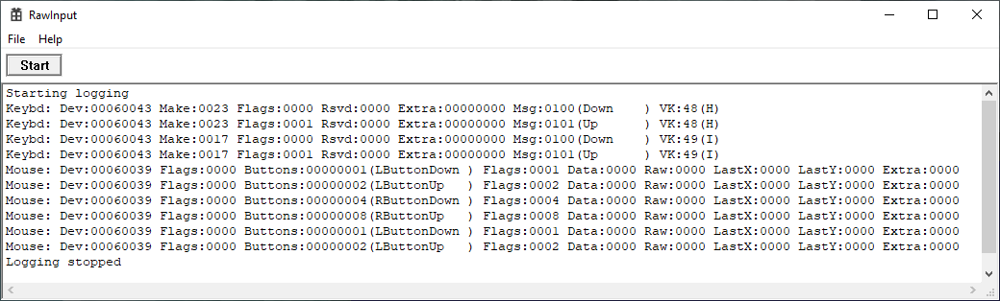

# Show Raw Input

**WIP** to show output from `RegisterRawInputDevices` and friends in a GUI application.  Primary use case
is to track down which keyboard in a multi-keyboard system is responsible for what keypress.

